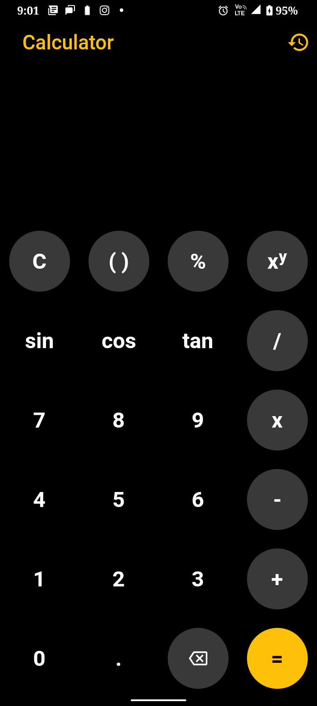
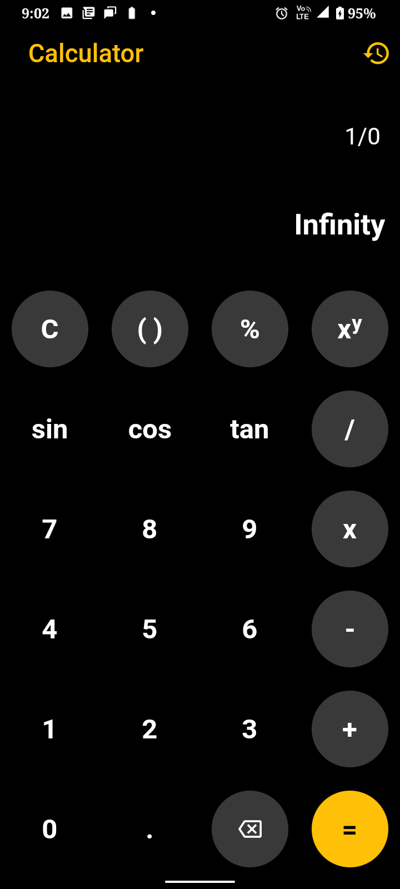
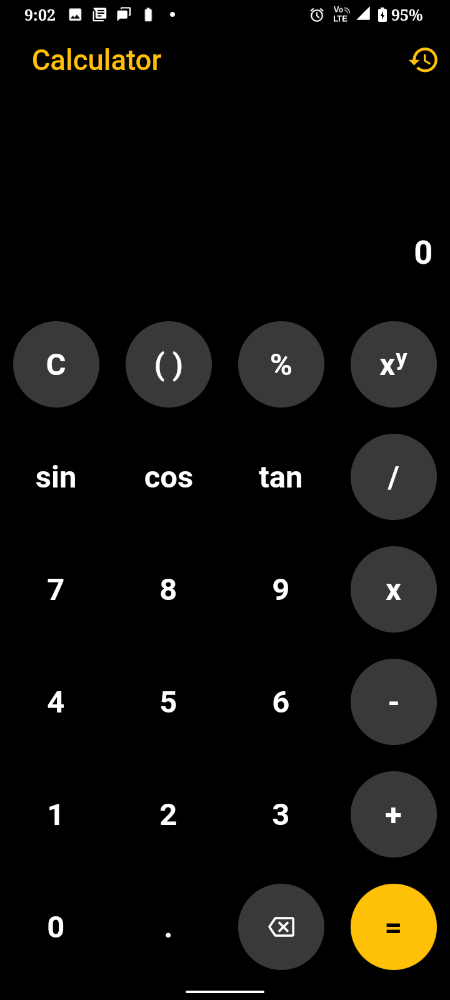
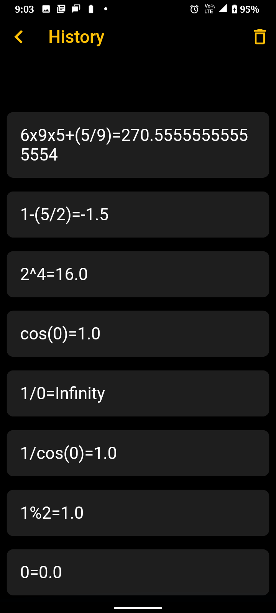

# Calculator

_This project was created with Flutter_

## Features
- Basic Calculator Operations including Addition, Subtraction, Multiplication, Division, Exponentiation and Modulus
- Trigonometric Functions including sine, cosine tangent
- Feature to store History so that you can get back to any stage of your calculation.
- You can also clear the history of you don't need them 

## Screenshots:

## To run this App:
- Get this repository code by running `git clone https://github.com/Rahman24/calculator-app`
- Navigate to the folder `cd calculator-app`
- Install the dependencies `flutter pub get`
- Run this application by running `flutter run lib/main.dart`
